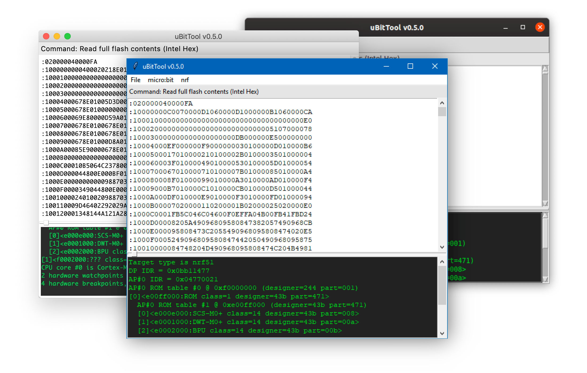

# uBitTool

uBitTool is a command line and GUI application to interface with the micro:bit.

It can:

- Read the micro:bit flash contents
- Extract user Python code from the micro:bit flash
- Flash the micro:bit
- Compare the contents of the micro:bit flash against a local hex file

  

## Docs

The documentation is online at
[https://carlosperate.github.io/ubittool/](https://carlosperate.github.io/ubittool/),
and its source can be found in `docs` directory.

## Basic Introduction

The easiest way to use uBitTool is via the application GUI.

- Download one of the latest GUI executables for macOS or Windows from the
  [GitHub Releases Page](https://github.com/carlosperate/ubittool/releases).
- Plug-in your micro:bit to the computer via USB
- Open the GUI executable file
- On the application menu click "nrf > Read Full Flash contents (Intel Hex)".
- A full image of the micro:bit flash should now be displayed in the GUI :)

For more information and instructions for other platforms please visit the
[Documentation](https://carlosperate.github.io/ubittool/).
