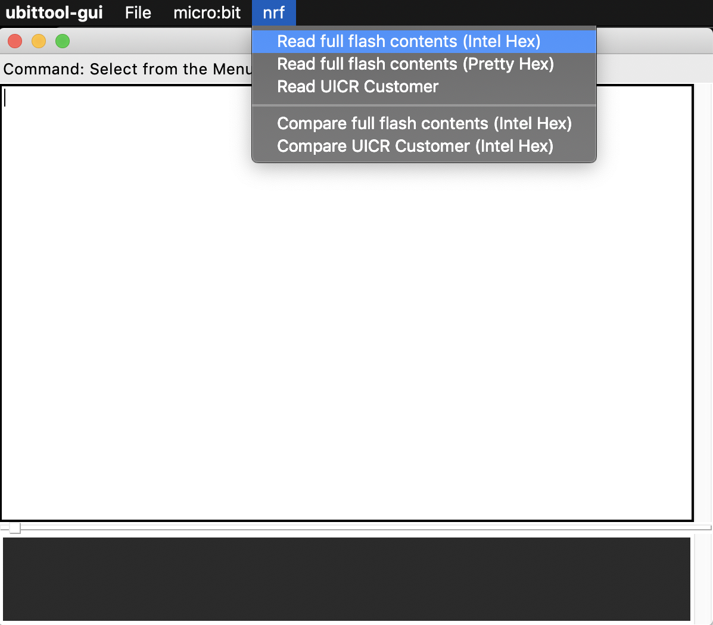
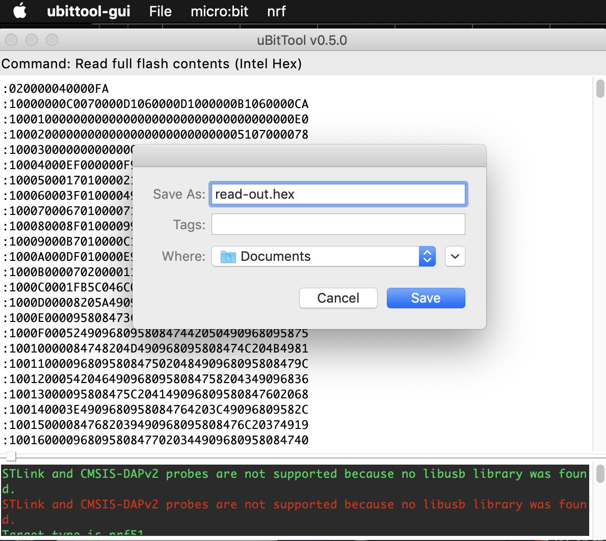

# How to use uBitTool

## GUI

### Read out the contents of a .hex file 

1. From the **nrf** menu select **Read full flash contents (Intel Hex)**



A full image of the .hex file will appear in the GUI.

2. From the **File** menu, select **Save as** and choose the destination to save your file. Add .hex as the suffix.



## Command Line

### Read out the contents of a .hex file 

Use ```read-flash``` which will output the contents to the console. You can optionally specify another output.

```
ubit read-flash > ~/Downloads/microbit-hex.hex
```